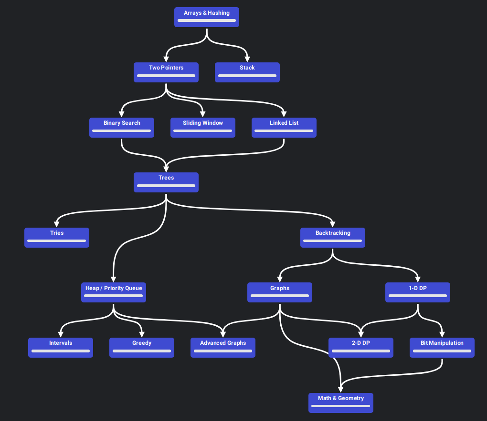

# Neetcode Roadmap

[NeetCode's Roadmap](https://neetcode.io/roadmap)

Following a simple list of must do leetcode exercises in order:

    

## Strategy

- Do a minimum of 5 problems per day
- If you get stuck for longer than 30 minutes, look at the solution, take mental
  note of what you missed, and move onto the next one or take a break.
- On Easy, aim for 15 minutes (time yourself). On Medium, aim for 25 minutes.
- Every three days go back and try and solve the problems from two days ago and
  try to solve them blind.
- Rinse and repeat until satisfied with your hit rate.

[Motivation & Strategy Hints](https://redlib.kylrth.com/r/learnprogramming/comments/12ghao8/a_guide_to_grinding_leetcode/)

[NeetCode's Blind75 Hints SpreadSheet](https://docs.google.com/spreadsheets/u/0/d/1A2PaQKcdwO_lwxz9bAnxXnIQayCouZP6d-ENrBz_NXc/htmlview)
