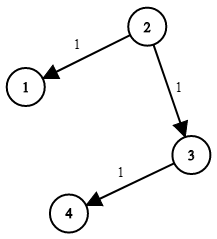

# 743. Network Delay Time

[Network Delay Time](https://leetcode.com/problems/network-delay-time/description/)

[Neetcode Solution](https://www.youtube.com/watch?v=EaphyqKU4PQ&pp=ygUbbmVldGNvZGUgTmV0d29yayBEZWxheSBUaW1l)

You are given a network of `n` nodes, labeled from `1` to `n`. You are also
given `times`, a list of travel times as directed edges
`times[i] = (u`<sub>i</sub>`, v`<sub>i</sub>`, w`<sub>i</sub>`)`, where
`u`<sub>i</sub> is the source node, `v`<sub>i</sub> is the target node, and
`w`<sub>i</sub> is the time it takes for a signal to travel from source to
target.

We will send a signal from a given node `k`. Return <em>the <b>minimum</b> time
it takes for all the</em> `n` <em>nodes to receive the signal</em>. If it is
impossible for all the `n` nodes to receive the signal, return `-1`.

**Example 1:**



```
Input: times = [[2,1,1],[2,3,1],[3,4,1]], n = 4, k = 2
Output: 2
```

**Example 2:**

```
Input: times = [[1,2,1]], n = 2, k = 1
Output: 1
```

**Example 3:**

```
Input: times = [[1,2,1]], n = 2, k = 2
Output: -1
```

**Constraints:**

- `1 <= k <= n <= 100`
- `1 <= times.length <= 6000`
- `times[i].length == 3`
- `1 <= u`<sub>i</sub>`, v`<sub>i</sub>`<= n`
- `u`<sub>i</sub>`!= v`<sub>i</sub>
- `0 <= w`<sub>i</sub>`<= 100`
- All the pairs `(u`<sub>i</sub>`, v`<sub>i</sub>`)` are <b>unique</b>. (i.e.,
  no multiple edges.)
