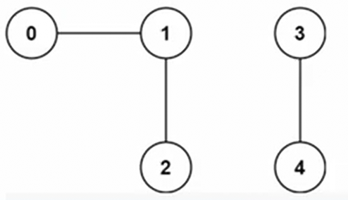

# 323. Number of Connected Components in an Undirected Graph

[Number of Connected Components in an Undirected Graph](https://neetcode.io/problems/count-connected-components)

[Neetcode Solution](https://www.youtube.com/watch?v=8f1XPm4WOUc&pp=ygU-bmVldGNvZGUgTnVtYmVyIG9mIENvbm5lY3RlZCBDb21wb25lbnRzIEluIEFuIFVuZGlyZWN0ZWQgR3JhcGg%3D)

There is an undirected graph with `n` nodes. There is also an `edges` array,
where `edges[i] = [a, b]` means that there is an edge between node `a` and node
`b` in the graph.

The nodes are numbered from `0` to `n - 1`.

Return the total number of connected components in that graph.

**Example 1:**

```
Input:
n=3
edges=[[0,1], [0,2]]

Output:
1
```

**Example 2:**

```
Input:
n=6
edges=[[0,1], [1,2], [2,3], [4,5]]

Output:
2
```

**Example 3:**



```
Input:
n=5
edges= [[0,1], [1,2], [3,4]]
Output:
2
```

**Constraints:**

- `1 <= n <= 100`
- `0 <= edges.length <= n * (n - 1) / 2`
