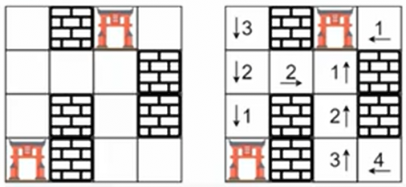

# 286. Walls and Gates

[Walls and Gates](https://neetcode.io/problems/islands-and-treasure)

[Neetcode Solution](https://www.youtube.com/watch?v=e69C6xhiSQE&pp=ygUYbmVldGNvZGUgV2FsbHMgQW5kIEdhdGVz)

You are given a $m$ x $n$ <b>2D</b> `grid` initialized with these three possible
values:

1. `-1` - A wall that <em>can not</em> be traversed.
2. `0` - A gate.
3. `INF` - Infinity m eans an empty room. We use the integer $2^31 -
   1 = 2147483647$ to represent `INF` as you may assume that the distance to the
   gate is less than `2147483647`.

Fill each empty room with the distance to <em>its nearest gate.</em> If it is
impossible tor eacha gate, it should be filled with `INF`.

**Example 1:**



```
Input: rooms = [
    [2147483647,-1,0,2147483647],
    [2147483647,2147483647,2147483647,-1],
    [2147483647,-1,2147483647,-1],
    [0,-1,2147483647,2147483647]
]

Output: [
    [3,-1,0,1],
    [2,2,1,-1],
    [1,-1,2,-1],
    [0,-1,3,4]
]
```

**Example 2:**

```
Input: rooms = [
    [0,-1],
    [2147483647,2147483647]
]

Output: [
    [0,-1],
    [1,2]
]
```

**Constraints:**

- `m == grid.length`
- `n == grid[i].length`
- `1 <= m, n <= 100`
- `grid[i][j]` is one of `{-1, 0, 2147483647}`
