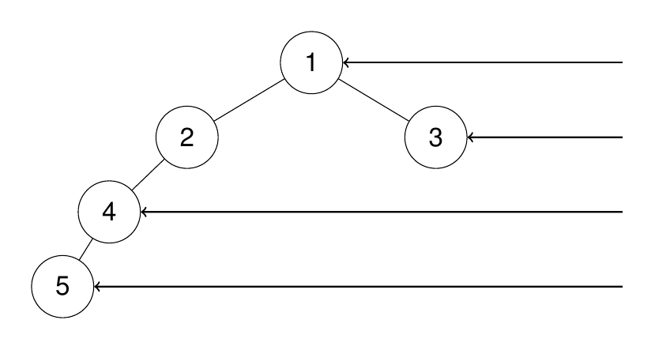

# 199. Binary Tree Right Side View

[Binary Tree Right Side View](https://leetcode.com/problems/binary-tree-right-side-view/description/)

[Neetcode Solution](https://www.youtube.com/watch?v=d4zLyf32e3I&pp=ygUkbmVldGNvZGUgQmluYXJ5IFRyZWUgUmlnaHQgU2lkZSBWaWV3)

Given the `root` of a binary tree, imagine yourself standing on the <b>right
side</b> of it, return <em>the values of the nodes you can see ordered from top
to bottom.</em>

**Example 1:**

```
Input: root = [1,2,3,null,5,null,4]

Output: [1,3,4]

Explanation:
```


**Example 2:**

```
Input: root = [1,2,3,4,null,null,null,5]

Output: [1,3,4,5]

Explanation:
```



**Example 3:**

```
Input: root = [1,null,3]

Output: [1,3]
```

**Example 4:**

```
Input: root = []

Output: []
```

**Constraints:**

- The number of nodes in the tree is in the range `[0, 100]`.
- `-100 <= Node.val <= 100`
